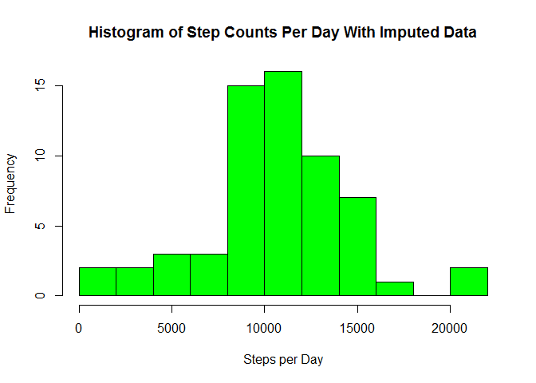

# Reproducible Research: Peer Assessment 1


## Loading and preprocessing the data
The data were loaded from a prepared dataset provided by the instructor of the class.


```r
df <- read.csv("activity.csv")
library(dplyr)
```

```
## 
## Attaching package: 'dplyr'
## 
## The following objects are masked from 'package:stats':
## 
##     filter, lag
## 
## The following objects are masked from 'package:base':
## 
##     intersect, setdiff, setequal, union
```

```r
df1 <- mutate(df, date = as.Date(date)) 
```

## What is mean total number of steps taken per day?
In this preliminary part of the analysis missing values will be ignored. The histogram shows the frequency of step counts per day.


```r
# we want to group by date in order to perform summaries by day
dategrp <- group_by(df1, date)
sum1 <- summarize(dategrp, stepsperday = sum(steps, na.rm = TRUE))
hist(sum1$stepsperday,col="green", breaks=12, xlab="Steps per Day", ylab="Frequency", main="Histogram of Step Counts Per Day")
```

 

```r
avgdailysteps <- mean(sum1$stepsperday)
mediandailysteps <- median(sum1$stepsperday)
```
The average number of steps taken per day is 9354.23.
The median number of steps taken per day is 10395.

## What is the average daily activity pattern?
The daily activity pattern can be computed by grouping the data set by the 5-minute intervals. It is helpful to view the actual minutes of the day instead of using the dataset's convention of labeling the intervals, which doesn't reflect the standard 1440 minutes per day. Some manipulation of the data is performed to enable this.

The plot shows the average number of steps per 5 minute period as a time-series trend.


```r
library(data.table)
```

```
## Warning: package 'data.table' was built under R version 3.2.3
```

```
## 
## Attaching package: 'data.table'
## 
## The following objects are masked from 'package:dplyr':
## 
##     between, last
```

```r
# use data.table for convenience in calculating new columns
DT <- data.table(df1)
# add a column that translates the labels for interval to an actual sequence of 5 minute intervals
DT[,mins:= {m <- (floor(interval/100));rem <- (interval - m*100); mins <- (m*60+rem)}]
df2 <- as.data.frame(DT)
# prepare df2 for grouping on factor mins
df2$mins <- as.factor(df2$mins)
grpmin <- group_by(df2, mins)
minutessum <- summarize(grpmin, sum(steps, na.rm=TRUE))
# calculate averages of steps per day by dividing by the number of total observations divided by # the number of observations per day, which is 288.
avg <- minutessum[,2]/(nrow(df2)/288)
# prepare the second column to be the actual number of minutes per day
avg[,2] <- 1:288
avg[,2] <- (avg[,2]-1)*5
colnames(avg) <- c("stepavg","minutes")
plot(avg$minutes,avg$stepavg,type="l", xlim =c(-1,1440),ylab="Steps last 5 min.",
     xlab="Minute of the Day", main="Average Daily Activity Pattern")
```

 

```r
maxperiod <- which(avg$stepavg==max(avg$stepavg))
approxtime <- avg[104,"minutes"]/60
```
The maximum number of steps taken on average over the entire period occurs at the 515 minute mark, approximately 8.58  hours after midnight.


## Imputing missing values
There are a significant number of missing values in the original dataset. The aim in this part of the analysis is to replace the missing values for every 5-minute period with the mean value calculated for the corresponding 5-minute period during the analysis of the data which removed missing values. To do this, a custom function named fillInNAsWithMeans was devised (because I couldn't think of a more elegant way to do it) that accepts a data frame containing the missing values and another data frame that contains the average values for each period. The function finds entries with missing values and replaces them with values from the second data frame from the corresponding period.

The analysis is repeated with the imputed values and compared with the first histogram.


```r
fillNAsWithMeans <- function(df1, df2) {
    i <- 1
    while(i <= length(df1[,1]))
    {
        if(is.na(df[i,1])) {
            # in the data set, the indexes correspond neatly to 288 observations per day
            # Calculating the index modulo 288 then yields the correct 5-minute period
            m <-  i%%288
            if(m==0)
                m <- 288
            # replace the NA with the value from the corresponding data frame with the averages
            # for each period.
            df1[i,1] <- df2[m,1]
        }
        i <- i+1
    }
    df1
}

totalNAs <- sum(is.na(df[,1]))
df2 <- fillNAsWithMeans(df1,avg)
dategrp <- group_by(df2, date)
sum2 <- summarize(dategrp, stepsperday = sum(steps))
hist(sum2$stepsperday,col="green",breaks=12,xlab="Steps per Day", ylab="Frequency",
    main="Histogram of Step Counts Per Day With Imputed Data")
```

 

```r
avgdailystepsimputed <- mean(sum2$stepsperday)

mediandailystepsimputed <- median(sum2$stepsperday)
```

Before imputing values, the number of observations with missing values was 2304.
The effect of imputing data was to raise the mean of the step count per day. In the first analysis where missing values were ignored, the mean was 9354.23. In this second analysis with imputed values, the mean was about 10581. The median was the same in both analyses, with a value of 10395.


## Are there differences in activity patterns between weekdays and weekends?
In the next analysis, the dataset is divided into weekdays and weekends and the activity patterns are compared. In essence, the analysis from previous sections is repeated for each subset of weekdays and weekends. The time series trends show significant differences.


```r
# add a column of factors differentiating weekday from weekend
df3 <- mutate(df2, weekday = ifelse(weekdays(df2[,2],abbreviate=TRUE)=="Sat" | 
    weekdays(df2[,2],abbreviate=TRUE)=="Sun","weekend","weekday"))
df3$weekday <- as.factor(df3$weekday)
# separate into two data frames
weekdaydf <- filter(df3,weekday=="weekday")
weekenddf <- filter(df3,weekday=="weekend")

# use data.table to create a minutes column that tracks the time as a real sequence of 
# 5-minute intervals. Do this for both weekday and weekend data frames.
DT <- data.table(weekenddf)
DT[,mins:={ m <- (floor(interval/100));rem <- (interval - m*100); mins <- (m*60+rem)}]
weekenddf <- as.data.frame(DT)
DT <- data.table(weekdaydf)
DT[,mins:={ m <- (floor(interval/100));rem <- (interval - m*100); mins <- (m*60+rem)}]
weekdaydf <- as.data.frame(DT)
weekenddf$mins <- as.factor(weekenddf$mins)
weekdaydf$mins <- as.factor(weekdaydf$mins)
# group by the minutes factor column so that we can summarize over a daily pattern
grpweekend <- group_by(weekenddf,mins)
grpweekday <- group_by(weekdaydf, mins)
sumweekend <- summarize(grpweekend,sum(steps)) # should not have to use na.rm=TRUE
sumweekday <- summarize(grpweekday,sum(steps))
weekendavg <- sumweekend[,2] /(nrow(weekenddf)/288)
weekdayavg <- sumweekday[,2]/(nrow(weekdaydf)/288)
weekendavg[,2] <- 1:288
weekendavg[,2] <- (weekendavg[,2] -1)*5
weekdayavg[,2] <- 1:288
weekdayavg[,2] <- (weekdayavg[,2]-1)*5
colnames(weekendavg) <- c("stepavg","minutes")
colnames(weekdayavg) <- c("stepavg","minutes")

par(mfrow=c(1,2), mar = c(4,4,2,1), oma = c(0,0,2,0))

plot(weekendavg$minutes,weekendavg$stepavg,type="l", xlim=c(-1,1440),
     ylab="Steps last 5 min.",xlab="Minute of the Day",
     main="Avg. Step Values - Weekends",cex.main=1.2)

plot(weekdayavg$minutes, weekdayavg$stepavg,type="l",xlim=c(-1,1440),
     ylab="Steps last 5 min.", xlab="Minute of the Day",
     main="Avg. Step Values - Weekdays",cex.main=1.2)

mtext("Activity for Weekends and Weekdays", outer=TRUE, cex=1.5)
```

 

```r
overhundredperiod_weekend <- which(weekendavg$stepavg > 100)
approxtime_weekend <- weekendavg[overhundredperiod_weekend,"minutes"]/60
overhundredperiod_weekday <- which(weekdayavg$stepavg > 100)
approxtime_weekday <- weekdayavg[overhundredperiod_weekday,"minutes"]/60
```
The plots seem to indicate much greater activity on the weekends. If we compare how many 5-minute periods contain more than 100 steps, we see that weekends have 32 high activity period, while weekdays have 14 high activity periods. The high activity periods for weekends is fairly distributed throughout the day from 8 AM until about 5:30 PM, while 92% of the high activity periods for weekdays occurs before 10 AM.

